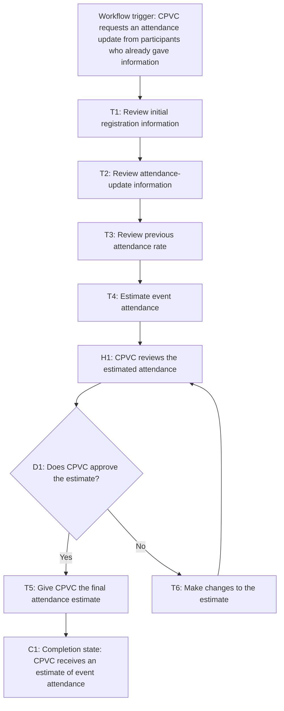

# Workflow of Tasks

*Replace all bracketed prompts with information specific to your proposed system. Delete instructional text that does not belong in your final specification. Add or remove task sections as needed. Every task shown in the general workflow must have a corresponding task specification below.*

## 1. Workflow Overview
### 1.1 Workflow Goal
This workflow supports the system goal defined in `my_first_agent/README.md`.

### 1.2 Workflow Trigger

The workflow will start when someone from CPVC makes a request to the participants that have already given their information to see an update of their attendance for the event.

### 1.3 Completion Condition at Runtime

HackTrack needs to give CPVC an estimation of the amount of people that will be attending the event.

### 1.4 General Workflow

HackTrack reviews the initial registration information. It will look at all the information that was given and look at the previous attendance rate to give an estimate of how many people will actually show up. Then that is when someone at CPVC will review what the system gave and make changes if needed. Once it's reviewed and approved HackTrack will then give the final estimate and CPVC will be able to better prepare for the event.

### 1.5 Workflow Diagram

[Insert a flowchart showing the tasks in sequence. Label each task with a task number and short name. Show decision branches, loops, review points, and possible stopping conditions. Below is an example of a Mermaid. You can either edit the mermaid below yourself or ask ChatGPT to generate a Mermaid script based on your workflow description above. Give every task a unique ID, such as T1, T2, and T3, and name tasks using a verb and an object in the mermaid.]

