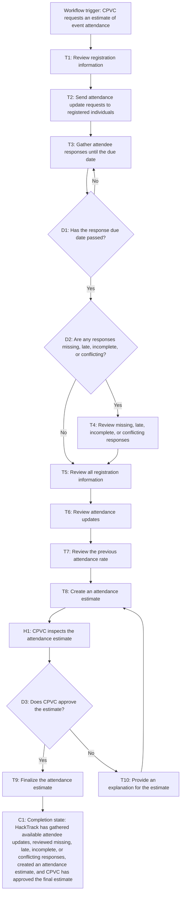

# Workflow of Tasks

*Replace all bracketed prompts with information specific to your proposed system. Delete instructional text that does not belong in your final specification. Add or remove task sections as needed. Every task shown in the general workflow must have a corresponding task specification below.*

## 1. Workflow Overview
### 1.1 Workflow Goal
HackTrack will support CPVC with estimating the amount of people that will be attending using registration information and having a attendee update.This system will allow CPVC to get a better estimate instead of just relying on the previous attendance-to-registration rate that was around 40% baseline. The system will do this without overstepping attendees privacy. 

### 1.2 Workflow Trigger

The workflow will start when someone from CPVC makes a request to get an estimation of how many people will attend their event. HackTrack should then send those attendance update request to individuals that have already registered for the Hackathon event. 

### 1.3 Completion Condition at Runtime

The workflow is complete when HackTrack has gathered up the available attendee updates, conflicting ,missing, or late responses, given a estimated calculation of attendees, and CPVC has approved of the last estimate. 

### 1.4 General Workflow
CPVC starts the workflow by requesting the system for an estimated update on attendance. HackTrack will look at the registration information and will send a attendance update request to those who have registered already. 

HackTrack will gather the responses until the due date. Those that are missing, late, incomplete, or have conflicting responses will be up for review. 

After the due date for responses the system will look at all the registration information, attancdance update, and will also look at the previous attendance rate to create an estimate for those who will attend. 

Then CPVC will inspect the estimate. If CPVC approves it the estimate given will be finalized. If it is not accepted CPVC will give explanation and the system will give estimates until CPVC finally approves it.  

### 1.5 Workflow Diagram

